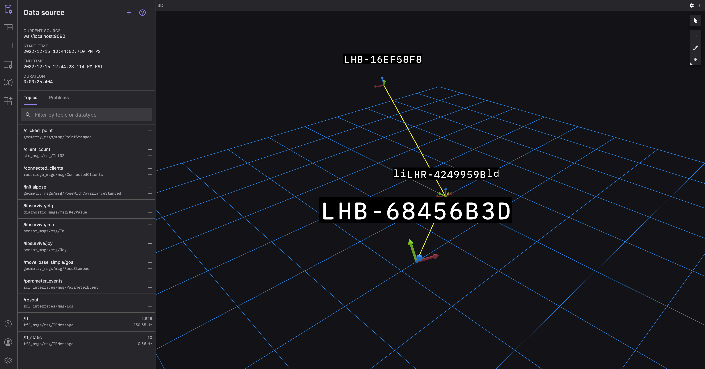

# libsurvive_ros2
**A Steam-free driver for republishing Lighthouse 1.0 and 2.0 pose and sensor data to ROS2**

This is a lightweight ROS2 wrapper around the [libsurvive](https://github.com/cntools/libsurvive) project, which provides a set of drivers for 6DoF rigid body tracking using SteamVR 1.0 and 2.0 hardware. It also listens for inertial, button, configuration and device connection events, and forwards these to various topics.

This hardware is particularly useful to robotics projects, because it provides a cost effective method of obtaining ground truth with a positional accuracy typically in the sub-centimeter, sub-degree range. The final accuracy of course depends on the tracking volume, base station number and placement and level of occlusion, as well as calibration quality.

The driver in this repo is largely based on the ROS1 driver [here](https://github.com/cntools/libsurvive/tree/master/tools/ros_publisher). It has been migrated to ROS2, and refactored slightly -- we use a thread to manage the blocking interaction with libsurvive, so that it doesn't lock the ROS2 callback queue and prevent messages from propagating correctly.

When you build this code `cmake` will checkout and build the latest stable release of `libsurvive` and link against this library for you. This is to avoid having to discover it through pkg-config, and ensures that you are using a version that has been tested and is known to work well with ROS2.

Progress:

- [x] code ported
- [x] documentation added
- [x] foxglove example
- [ ] test imu, buttons and sensors
- [ ] add linting checks
- [ ] convert to lifecycle node
- [ ] verify composable node

# Installation instructions

This has only been tested on Ubuntu 22.04 and ROS Humble, although its fairly likely to work correctly with other distributions too. Pull requests are welcome if it does not!

Before you do anything, you will need to install these udev rules and reload the subsystem.

```
sudo curl -fsSL https://raw.githubusercontent.com/cntools/libsurvive/master/useful_files/81-vive.rules \
    -o /etc/udev/rules.d/81-vive.rules
sudo udevadm control --reload-rules && udevadm trigger
```

You can now choose to build the driver natively or in a container. The benefit of launching it within a container is that it won't interfere with any pre-existing ROS installation on your machine. However, you will need docker-ce and the compose plugin for things to work.

## Containerized installation (easier)

Install docker: https://docs.docker.com/engine/install/ubuntu/

```sh
$ docker compose build
```

This will checkout a lightweight ROS2 rolling container, augment it with a few system dependencies, checkout and build the code and drop you into a bash shell as user `ubuntu` at the home directory `~/ros2_ws/src`.

## Native installation (more flexible)

You'll need ROS2 installed: https://docs.ros.org/en/humble/Installation.html

You'll also need to follow the instructions here: 

```sh
sudo apt-get install build-essential \
    zlib1g-dev \
    libx11-dev \
    libusb-1.0-0-dev \
    freeglut3-dev \
    liblapacke-dev \
    libopenblas-dev \
    libatlas-base-dev \
    cmake
```

Finally source ROS2, create a workspace, checkout, compile and source the code:

```
$ mkdir ~/ros2_ws/src
$ cd  ~/ros2_ws/src
$ git clone https://github.com/asymingt/libsurvive_ros2.git
$ cd ..
$ colcon build
$ source install/setup.bash
```

# Running the code

To run the driver on containerized installations do the following:

```sh
$ docker compose up
```

Alternatively, to run the driver on native installations run the following:

```sh
$ ros2 run libsurvive_ros2 libsurvive_ros2.launch.py rosbridge:=true
```

There are three launch arguments to `libsurvive_ros2.launch.py` to help get up and running:

- `namespace = string (default: 'libsurvive')` : This is the namespace on which to add the extra topics for sensor data.
- `record = boolean (default: false)` : Start a `ros2 bag record` to save `/tf` and `/tf_static` topics to a ros bag in the ROS2 log directory for the current launch ID as `libsurvive.bag`.
- `rosbridge = boolean (default: false)` : Starts a `rosbridge_server` and `rosapi`, which offers data over a websocket by default at port 9090, which allows you to stream directly into the [foxglove.dev](https://foxglove.dev) robotics visualization tool.
- `composable = boolean (default: false)`: For advanced users only -- it shows how to load the component-based version of the code to get zero-copy IPC between it and other composable nodes. 

# Example visualization with Foxglove

After launch the stack (with `rosbridge:=true`), navigate to [this Foxglove link](https://studio.foxglove.dev/?ds=rosbridge-websocket&ds.url=ws%3A%2F%2Flocalhost%3A9090
) and you should see the data streaming:



Now move the tracker around and you should see its corresponding transform move around inn the user interface.

# Common questions

- **I don't see any data streaming** Examine the console log. If you see a LIBUSB error, chances are high that you either haven't installed the udev rules, or you haven't mounted the /dev/bus/usb volume correctly into the docker container.

- **How do I configure this for my specific tracker ID?** There's no need -- the libsurvive driver will enumerate all devices, query their ID and publish this ID as the transform name using the TF2 standard topic `/tf`. Base station positions change less frequently, and so they are published at a lowe rate on `/tf_static`.

- **The base stations locations are not where I'd expect them to be** -- The calibration phase of libsurvive works out the relative location of the base stations. It has no idea of their orientation with respect to the room. To fix this, you will need to write your own static transform broadcaster to provide the relationship between your world frame and the `libsurvive_world` frame.

- **In need to send extra arguments to the driver** -- Have a look at the `libsurvive_ros2.launch.py` file, and particularly at the `parameters` variable. You should probably be writing your own launch file, and you can include custom modifications for your specific tracking setup by changing the parameters you pass to the driver.


